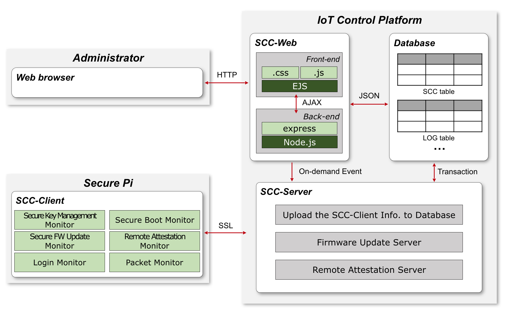

# Security Control Center  

> SCC는 COTS IoT 디바이스 보안 플랫폼(SecurePi, SArduino)의 보안 관제를 위한 시스템입니다.  

[발표자료 바로가기 - Slide Share](https://www.slideshare.net/JunyoungJung8/scc-security-control-center)  

## 프로젝트 소개  

### 0. 요약  

최근 디바이스 보안 문제와 관련된 각종 IoT 보안 사고가 점차적으로 증가하고 있다. 이러한 보안 이슈를 해결하기 위해서는 IoT 환경 내 디바이스 보안 측면을 고려한 IoT 디바이스가 필수적으로 사용되어야 하고, 각종 사이버 위협에 적절히 대응할 수 있는 보안 관제 서비스가 운영되어야 한다. 본 프로젝트에서는 선행 연구인 IoT 디바이스 보안 플랫폼의 각종 보안 기능을 기반으로 보안 관제 수행에 필요한 기능을 정의하였고, 정의된 기능을 바탕으로 보안 관제 시스템을 설계 및 구현하였다.  

*** 

### 1. 연구 개요  

IoT 디바이스의 안전한 상태를 주기적으로 확인하고 유지하기 위해서는 보안 관제 시스템이 필요하다. 본 연구에서는 앞서 개발된 디바이스 보안 플랫폼을 관리하기 위한 보안 관제 시스템을 구축하였다. 그리고 이를 통해, 다양한 디바이스 보안 플랫폼들을 통합적으로 관리 할 수 있는 보안 관제 시스템(SCC; Security Control Center)을 개발하였다.  

SCC가 제공하는 기능은 ①Secure Key Storage & Management Monitoring, ②Secure Boot Monitoring, ③Secure Firmware Update Management, ④Remote Attestation Monitoring, ⑤Login Information Monitoring, ⑥IP/Port Information Monitoring과 같다. 이러한 기능들을 통해 SCC 관리자는 수 많은 IoT 디바이스들을 효율적으로 침해 대응 및 관제 할 수 있으며, 실시간 감시를 통해 다양한 불법적 주체에 대한 접근을 차단할 수 있다.  

*** 

### 2. 관련 연구  

기존 연구로써 개발된 IoT 디바이스 보안 플랫폼(Secure Pi)은 oneM2M 보안 요구사항을 만족함과 동시에 하드웨어
보안 칩인 TPM을 기반으로 아래와 같은 시스템 보안 기술을 제공한다.  

* **Secure Key Storage & Management**: 암호화 키를 안전하게 보관 및 관리하기 위한 기술  
* **Secure Boot**: 펌웨어 무결성을 보장하기 위한 기술  
* **Secure F/W Update**: 안전한 펌웨어 업데이트 지원 기술  
* **Remote Attestation**: 디바이스의 신뢰 상태 증명 기술  
* **Secure Communication**: 디바이스 간 안전한 통신  
* **Mandatory Access Control**: 보안 레벨 기반의 접근 제어  
* **Filesystem Integrity**: 파일 시스템 무결성 보장 기술  
* **Filesystem Encryption**: 파일 시스템 기밀성 보장 기술  

*** 

### 3. 제안하는 시스템  

IoT 보안 관제 시스템 설계를 위한 요구사항 분석 및 기능을 정의한다. 또한, 정의된 기능을 바탕으로 설계된 보안 관제 시스템(SCC; Security Control Center)에 대해 소개하도록 한다.  

#### 3-1. 시스템 요구사항 분석 및 기능 정의  

Secure Pi의 기본적 보안 기능을 기반으로 보안 관제 수행에 필요한 기능적 요구사항은 아래와 같다.  

* **민감 데이터 가용성 보장**: Secure Pi는 TSS(TCG Software Stack)를 통해 TPM에 각종 암호화 키 데이터를 저장, 관리한다. 이러한 키 데이터가 사용될 수 없을 경우, 다른 보안 요소기술들의 정상적인 동작을 보장 할 수 없으며, 이는 TSS Daemon을 통해 알 수 있다. 따라서, Secure Pi의 TSS Daemon을 주기적으로 모니터링 하여 Secure Key Storage & Management 확인을 위한 기능이 필요하다.  
* **펌웨어 무결성 보장(Secure Boot)**: Secure Pi는 TPM을 사용하여, 각 부트 단계마다 미리 생성한 서명과 각 부트 과정에서 생성한 서명의 일치 여부를 판단하여 펌웨어 교체 공격을 막을 수 있다. 따라서, 보안 관제 시스템은 Secure Boot 확인을 위한 기능이 필요하다.  
* **안전한 펌웨어 업데이트 보장**: Secure Pi는 TPM을 사용하여 이전 버전의 펌웨어 설치를 방지하는 Secure Firmware Update를 제공한다. 그러므로 IoT 보안 관제 시스템은 Secure Firmware Update 확인을 위한 기능이 필요하며, Update 서버의 역할을 해야한다.  
* **펌웨어 무결성 보장(Remote Attestation)**: IoT 디바이스는 펌웨어 교체 공격을 방지할 수 있어야 한다. Remote Attestation은 다른 기기와 상호 인증하여 펌웨어 무결성을 보장하는 기술이다. IoT 보안 관제 시스템은 Remote Attestation 확인을 위한 기능이 필요하며, Attestation 서버의 역할을 해야한다.  
* **디바이스 로그인 시도 감지**: 리눅스 기반의 COTS IoT 디바이스인 Secure Pi는 로그인 기록을 /var/log/auth.log 파일에 남긴다. 따라서 IoT 보안 관제 시스템은 주기적으로 로그인 기록 확인을 위한 기능이 필요하다.  
* **디바이스 허용/거절 패킷 감지**: 리눅스 기반의 COTS IoT 디바이스인 Secure Pi는 방화벽으로 Iptables를 사용할 수 있다. Iptables를 사용하면 플랫폼에 들어오는 패킷에 대한 정책을 설정할 수 있고, 허용/거절한 패킷에 대한 로그를 기록할 수 있다. 따라서, IoT 보안 관제 시스템은 주기적으로 허용/거절되는 패킷의 확인을 위한 기능이 필요하다.  

#### 3-2. 시스템 아키텍쳐  

  

SCC는 [위 그림](https://github.com/sauber92/Security_Control_Center/blob/master/README/picture-1.png)과 같이 SCC-Client, SCC-Server, SCC-Web, Database로 구성되어 있으며 SCC 관리자는 웹 브라우저를 통해 Secure Pi를 모니터링 한다.  

SCC-Server, SCC-Web, Database가 있는 IoT Control Platform은 Ubuntu PC(16.04 LTS)를 사용하였고, SCC-Client가 있는 Secure Pi는 Raspberry Pi 2 (Model 2)에 Atmel TPM을 장착하였다.  

SCC-Client는 수집한 Secure Pi의 데이터를 SCC-Server에 안전하게 전달하기 위해 SSL(Secure Sockets Layer)을 사용하였으며, SCC-Server는 SFTP(SSH File Transfer Protocol)를 이용하여 Secure Pi의 펌웨어 업데이트를 진행한다. SCC-Server가 파일 입출력을 통해 Database에 저장한 데이터는 SCC-Web이 JSON(JavaScript Object Notation)과 AJAX(Asynchronous JavaScript and XML)을 사용하여 웹 페이지의 형태로 나타낸다.  

#### 3-3. SCC-Client  

SCC-Client는 Secure Pi의 보안 요소기술들이 동작하면서 생성한 로그 파일 및 에러메시지를 SCC-Server에 전달하며, 앞서 설명한 IoT 보안 관제 시스템 설계를 위한 요구사항과 대응하는 기술이다.  

**1) Secure Key Management Monitor**  
TSS(TCG Software Stack)는 Secure Pi를 사용하기 위해 필요한 TPM 드라이버와 소프트웨어의 요구사항을 충족시켜 주는 소프트웨어 프레임워크이다. TSS를 사용하면 Secure Pi의 보안 요소기술들에 사용하는 키가 안전하게 생성되고 저장되었다는 것을 확인할 수 있다. SCC-Client는 이를 통해 Secure Key Storage & Management Monitoring을 수행하고 결과값을 SCC-Server로 전달한다.  

**2) Secure Boot Monitor**  
Secure Pi 부팅 시, TPM이 생성한 키를 사용하여 Secure Boot를 정상적으로 작동했는지를 판단하고 결과값을 SCC-Server로 전달한다.

**3) Secure Firmware Update Monitor**  
SCC-Server로부터 펌웨어 업데이트를 진행하라는 신호와 펌웨어를 받으면 전송 받은 펌웨어에 대한 무결성 검증을 실시한다. 무결성 검증을 통과하면 업데이트를 진행하고, Secure Pi를 재 부팅 후 결과값을 SCC-Server로 전달한다.  

**4) Remote Attestation Monitor**  
Secure Pi 부팅 시, 주요 프로그램(부트로더, 커널, Secure Boot Daemon, 기타 프로그램)에 대한 무결성 검증을 위해 TPM을 사용하여 시그니처를 만들고 SCC-Server로 전달한다.  

**5) Login Monitor**  
리눅스 기반의 플랫폼은 모든 로그인 시도가 /var/log/auth.log 파일에 기록된다. SCC-Client는 주기적으로 Secure Pi의 auth.log 파일을 확인하고 로그인 기록 결과값을 SCC-Server로 전달한다.  

**6) Packet Monitor**  
Iptables를 사용하면 플랫폼에 들어오는 패킷에 대한 정책을 설정할 수 있고 Iptables가 허용/거절한 패킷에 대한 로그를 기록할 수 있는 방화벽이다. SCC-Client는 주기적으로 Secure Pi의 Iptables의 패킷 허용/정책과 로그를 확인하고 결과값을 SCC-Server로 전달한다.  

#### 3-4. SCC-Server  

SCC-Server는 다음과 같은 세가지 기능을 수행한다. 첫째, SCC-Client가 8가지 보안 기술의 결과 값을 전달하면 이를 지정된 에러 코드에 맞게 분류하여 Database DEVICE 테이블에 저장한다. 둘째, SCC-Web에서 펌웨어 업데이트를 하기 위한 마우스 클릭 이벤트가 발생하면, Database FIRMWARE 테이블을 확인하고 현재 Secure Pi의 펌웨어 버전과 최신 펌웨어 버전을 비교한다. 만약 두 버전이 일치하지 않으면 SCC-Client에 신호를 보내어 Secure Firmware Update를 실행시키고, FIRMWARE 테이블에 업데이트 동작을 기록한다. 두 버전이 일치할 때에도 FIRMWARE 테이블의 업데이트 동작 요청이 들어왔다는 것을 기록한다. 셋째, Secure Pi가 부팅되어 SSL 연결이 되면, SCC-Client에 신호를 보내어 Attestation을 실행시킨다.  

#### 3-5. SCC-Web and Database  

* Back-end: Node.js, Express.js  
* Front-end: EJS, Bootstrap  
* DBMS: MySQL  

***

### 4. 결론  

IoT 디바이스의 보안을 위해 디바이스 수준을 고려한 보안 플랫폼과, 이를 모니터링 하는 보안 관제 시스템이 필요하다. 본 논문에서는 IoT 디바이스 보안 관제 시스템의 핵심 요소기술을 정의하였고, 이전 연구를 통해 개발된 IoT 디바이스 보안 플랫폼을 기반으로, 보안 관제 시스템을 제한하였다. 이를 통해 보안 관제 시스템의 관리자는 IoT 디바이스들을 효율적으로 침해 대응 및 관제 할 수 있으며, 실시간 감시를 통해 다양한 불법적 주체에 대한 접근을 차단할 수 있다. 즉, oneM2M에서 제안하는 IoT 디바이스의 보안 진단 및 컨설팅이 가능하다. 향후 연구로 RTOS/펌웨어 기반의 저사양 IoT 디바이스 플랫폼의 설계를 완료하여 구현 중에 있으며, 이 또한 모니터링 할 수 있도록 고려하여 보안 관제 시스템의 품질을 향상시킬 계획이다.  

***

### 5. License  

[MIT 라이센스](https://github.com/sauber92/Security_Control_Center/blob/master/LICENSE)  

*** 

### 6. 개발자  

**정준영**: 경희대학교 전자공학과/컴퓨터공학과 12학번  

* Mail: jjy920517@gmail.com  
* Github: [https://github.com/sauber92](https://github.com/sauber92)  
* Blog: [https://sauber92.github.io](https://sauber92.github.io)  
